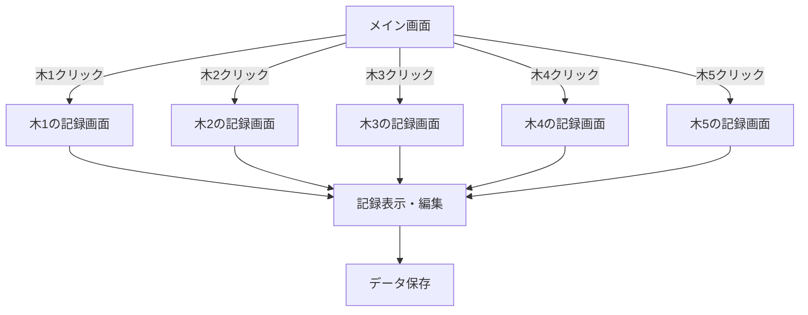

# 栗の木成長記録アプリ計画書

## プロジェクト概要
- Webブラウザで動作する栗の木5本の成長記録アプリ
- PC・モバイル両対応のレスポンシブデザイン
- ユーザー自身が画像を用意

## 機能要件
1. メイン画面
   - 5本の木を画像で表示
   - クリック/タップで詳細画面へ遷移
2. 詳細画面
   - 選択した木の記録を表示
   - 記録編集フォーム (日付、成長記録、施肥情報、写真)
   - データ保存機能

## 技術仕様
- フロントエンド: HTML5, CSS3, JavaScript
- データ保存: ローカルストレージ
- レスポンシブ対応:
  - PC: 3列グリッド表示
  - モバイル: 1列縦並び表示
  - メディアクエリ (ブレークポイント: 768px)

## 画面設計

## 開発手順
1. プロジェクトディレクトリ作成
2. 基本HTML/CSS構造作成
3. レスポンシブデザイン実装
4. 画像プレースホルダー配置
5. クリック/タップイベント実装
6. データ保存機能実装
7. 詳細画面のフォーム実装
8. テスト (PC/モバイル表示確認)